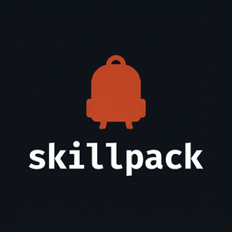

<div align="center"></div>

# skillpack — the distribution-layer generator + verifier for AI agents, not a skill library.

[](https://github.com/nordicnode/skillpack/actions/workflows/ci.yml)
[](https://crates.io/crates/skillpack)
[](LICENSE)
[](https://www.rust-lang.org)

Coding agents (Claude Code, Cursor, Codex, OpenCode, GitHub Copilot) now discover and invoke
tools by reading marketplace manifests, skill files, and CLIs — not by `npm install`-ing
on instinct. An OSS project's code quality no longer matters if the agent can't find,
understand, and autonomously invoke the tool. That wiring around a library or CLI is the
**distribution layer**, and `skillpack` generates it for you — then verifies that a coding
agent coming in cold could actually use what you shipped.

`skillpack` takes any OSS project and generates the agent distribution files for
one or more coding-agent ecosystems (Claude Code, Cursor, Codex, OpenCode, GitHub Copilot),
then runs a verification suite that simulates an agent's first read and actually invokes
the documented CLI to catch drift before it reaches a user.

## What it generates

From your repo, `skillpack init` writes (purely additive — nothing existing is touched).
By default it targets Claude Code; pass `--target cursor` / `--target codex` /
`--target opencode` / `--target copilot` to emit for additional agents (repeatable):

**Claude Code** (`--target claude`, default):

- `.claude-plugin/marketplace.json` — a single-plugin marketplace entry pointing at your project root
- `.claude-plugin/plugin.json` — the plugin manifest (name, version, author, repo URL)
- `skills/<tool-name>/SKILL.md` — the operational knowledge file an agent reads (frontmatter + body, including a `### Subcommands` block for CLIs with subcommands)

**Cursor** (`--target cursor`):

- `.cursor/rules/<tool-name>.mdc` — a Cursor project rule with `description` / `alwaysApply` frontmatter and the same invocation body

**Codex CLI** (`--target codex`):

- `.codex/skills/<tool-name>/SKILL.md` — same `SKILL.md` frontmatter and body as Claude (cross-agent compatible), installed under Codex's `.codex/skills/` convention

**OpenCode** (`--target opencode`):

- `.opencode/agents/<tool-name>.md` — an OpenCode subagent definition with `description` / `mode` frontmatter and the same invocation body

**GitHub Copilot** (`--target copilot`):

- `.github/copilot-instructions.md` — a Copilot instructions file (plain markdown, no frontmatter) with the same invocation body

A `skillpack.toml` at your project root captures your answers so re-runs are deterministic
and CI-friendly.

## Supported ecosystems

| Language | CLI detection                             |
|----------|-------------------------------------------|
| Rust     | built binary under `target/`, or on PATH  |
| Node     | `node <script>` from a `package.json` bin |
| Python   | `python -m <pkg>` from `[project.scripts]` |
| Go       | `go run .` for a `package main` project   |
| Ruby     | a `ruby exe/<name>` (or `bin/<name>`) binstub |
| PHP      | `php <script>` from a `composer.json` `bin` entry |
| JVM      | pre-built Gradle `installDist` script, or `java -jar` a Maven shaded / Gradle shadow jar (pure filesystem reads — no build invoked) |
| C#       | `dotnet run --project <csproj>` (SDK-style, `OutputType=Exe`; `WinExe` GUI projects skipped) |

Projects without a CLI take the pure-library path: `SKILL.md` documents the install +
import pattern instead, and the invocation test is a no-op. The `has_cli` flag is the
single branching point.

> **Platform:** Cross-platform — CI runs on Ubuntu, macOS, and Windows. CLI
> detection probes `PATH` with `PATHEXT` enumeration on Windows (so a bare
> `node` lookup resolves `node.exe`), and `cargo build` artifacts carry the
> `.exe` suffix. Paths are normalized to forward slashes in the verify
> report. PATHEXT enum (0.6.0), `.exe` artifact probe (0.6.3), and `\\?\`
> UNC-prefix strip (0.6.4) brought Windows to parity.

## Install

```sh
cargo install skillpack    # from crates.io
```

Or build from source: `cargo install --path .` (or `cargo build --release` for a
local binary under `target/release/`).

Requires Rust 1.74+. Published on [crates.io](https://crates.io/crates/skillpack).

## Quick start

```sh
# In your OSS project root:
skillpack init            # introspect → interview → generate → pre-commit verify

# Generate for multiple agent ecosystems at once:
skillpack init --target claude --target cursor --target codex --target opencode --target copilot

# Re-run anywhere / in CI (deterministic, non-interactive):
skillpack init --non-interactive --accept-warnings

# Check a generated (or hand-written) skill pack:
skillpack verify

# Diagnose language/CLI detection (read-only, exit 0):
skillpack doctor
```

`init` runs the full `verify` suite against its own output **before** writing files, so
the worst case — a broken skill pack that looks fine until an agent tries to use it — is
caught up front.

## Does it actually help agents? (measured)

Four fd search tasks, run with [OpenCode](https://opencode.ai) on a plain
clone of `sharkdp/fd` versus the same clone + `skillpack init --target opencode --target claude --target cursor`.
Same model, same questions, same capture format:

| Metric | plain clone | clone + skillpack | delta |
|---|---|---|---|
| Agent step rounds | 20 | 5 | **-75%** |
| Token total | 38,134 | 22,248 | **-42%** |
| Wall clock | 130 s | 27 s | **-79%** |

Both conditions got all four answers right; the delta is **efficiency and fewer
detours**, not capability the agent couldn't otherwise reach. The biggest win was
Q4: the plain-clone agent hit fd's `--max-results`/`-x` incompatibility error and
retried four times; the generated OpenCode agent (invoked via `--agent fd-find`) had the verified `-x`/`--exec` mapping in `.opencode/agents/fd-find.md` and answered in one step.

Full methodology, per-question analysis, and honest limitations (including one
spot where the skillpack agent was *less* accurate than the baseline) are in
[`docs/agent-demo.md`](docs/agent-demo.md).

## What `verify` checks

**Discovery** — structural validation per ecosystem. Claude Code (the
`.claude-plugin/` + `skills/` set) is checked against the documented plugin
schema:

- plugin / marketplace names are kebab-case and not reserved
- `description` is present and the combined description + `when_to_use` stays under the
  1,536-character listing cap
- `when_to_use` carries trigger phrases an agent can match on
- marketplace `source` paths use the `./` prefix and forward slashes only
- `version` is present in `plugin.json` (warns on missing/empty)
- `author` is present in `plugin.json` (warns on missing or `"Unspecified"`)
- `version` in `plugin.json` matches the project manifest version (warns on drift; a stale 0.6.4 vs 0.8.1 self-dogfood caught by this check)

**Cursor** (`.cursor/rules/<name>.mdc`) — frontmatter is parsed and
validated against cursor.com/docs/rules: `description` present, non-empty,
under the 1,536-char listing cap; `alwaysApply` present and boolean
(missing or non-boolean warns). **Codex** (`.codex/skills/<name>/SKILL.md`)
reuses the same `SKILL.md` frontmatter schema as Claude (fields, length
caps, name validation), namespaced under `discovery.codex.skill.*`.
**OpenCode** (`.opencode/agents/<name>.md`) validates the `---` frontmatter
block: `description` present, non-empty, under the listing cap (hard fail);
`mode` (if present) one of `primary|subagent|all` (warn). **GitHub Copilot**
(`.github/copilot-instructions.md`) validates plain markdown: non-empty,
first non-blank line starts with a `#` heading. A single-ecosystem pack
(e.g. `--target copilot` alone) passes `verify` without false-positive
failures from the other ecosystems.

**Invocation** — actually runs the documented CLI:

- `--help` executes cleanly under a hard timeout
- every flag documented in `SKILL.md` exists in the real `--help` output (catches drift)
- flags the CLI advertises in `--help` that `SKILL.md` doesn't document (a discoverability
  warning, so an agent doesn't miss options)
- for CLIs with subcommands (clap-style `Commands:` sections), `init` captures each
  subcommand's `--help` and documents them in a `### Subcommands` block; `verify`
  spawns `<cli> <sub> --help` per documented subcommand and drift-checks its flags

`verify` works on hand-written skill packs too, not just `init` output: it derives whether a
CLI is documented from the `SKILL.md` itself (a `## Invocation` section, or a fenced block
with `--flags`). If the skill documents a CLI but no runnable binary is found on your machine,
the invocation check is reported as a **warning** (not silently skipped), so the gap is visible.
The invocation check runs against the **first** documented CLI; discovery checks above run
against every `SKILL.md` (a plugin may ship several).

**Discoverability score** — every `verify` run computes a 0-100 score: each
check contributes Pass = 1.0, Warn = 0.5, Error = 0.0, divided over non-skipped
checks. The JSON report carries it as `discoverability_score` (integer); the
human report prints it in the summary line. Track it over time as a single
agent-discoverability health number — it does not gate the exit code (only
critical failures do).

Exits non-zero on any critical failure, so it drops straight into CI as a PR
gate. Pass `--format json` for a machine-readable report (per-check ids,
counts, `ok` flag, `discoverability_score`) for scripting.

## Flags

| Flag                    | Purpose                                                          |
|-------------------------|------------------------------------------------------------------|
| `init --non-interactive` | skip prompts; requires a `skillpack.toml` (for CI)             |
| `init --accept-warnings` | write files even when `verify` flags warnings (critical still blocks). Without it, warnings prompt before writing in interactive mode |
| `init --license <SPDX>`  | override the license for this run                              |
| `init --target <ecosystem>` | agent ecosystem(s) to generate for: `claude` (default), `cursor`, `codex`, `opencode`, `copilot`. Repeatable. |
| `doctor` | read-only diagnosis: print detected language, CLI, and diag trace (exit 0) |
| `verify --format human\|json` | human report (default) or machine-readable JSON for CI   |
| `--verbose`             | print what `skillpack` detected in the repo (introspection)      |
| `--debug`             | print every subprocess call                                       |

## Status

`init` + `verify` + `doctor` across the eight language ecosystems above. Generates and
verifies distribution files for **Claude Code** (default), **Cursor**
(`.cursor/rules/*.mdc`), **Codex CLI** (`.codex/skills/`), **OpenCode**
(`.opencode/agents/`), and **GitHub Copilot** (`.github/copilot-instructions.md`).
MIT-licensed. `verify` runs the discovery suite against every ecosystem `init` targets —
a broken `.mdc`, Codex `SKILL.md`, OpenCode agent, or Copilot instructions file fails CI
alongside a Claude-side defect. A bundled skill-pack marketplace is a later phase.

## Contributing

See [CONTRIBUTING.md](CONTRIBUTING.md). Template edits (`templates/*.tera`) need
no Rust knowledge — the snapshot tests catch any silent change to generated
output.

## License

MIT. See [LICENSE](LICENSE). See [CHANGELOG.md](CHANGELOG.md) for release history.
