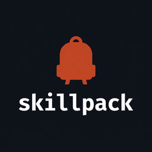

<div align="center">
  
  <p><strong>The agent-distribution layer for modern OSS tools and libraries.</strong></p>
  <p>Generate, verify, and maintain agent instructions across Claude Code, Cursor, Codex, OpenCode, GitHub Copilot, Freebuff, and 14 AI coding ecosystems.</p>

  <p>
    <a href="https://github.com/nordicnode/skillpack/actions/workflows/ci.yml"></a>
    <a href="https://crates.io/crates/skillpack"></a>
    <a href="https://crates.io/crates/skillpack"></a>
    <a href="https://docs.rs/skillpack"></a>
    <a href="LICENSE"></a>
    <a href="https://www.rust-lang.org"></a>
  </p>

  <p>
    <a href="#quick-start">Quick Start</a> ·
    <a href="#key-features">Features</a> ·
    <a href="#what-skillpack-generates">What You Get</a> ·
    <a href="#command-line-reference">CLI Reference</a> ·
    <a href="docs/reference.md">Docs</a> ·
    <a href="CHANGELOG.md">Changelog</a> ·
    <a href="CONTRIBUTING.md">Contributing</a>
  </p>
</div>

---

<h2 align="center">Built with Freebuff</h2>

<div align="center">
  <p><strong>This project was made possible by <a href="https://freebuff.com">Freebuff</a>, the free AI coding agent.</strong><br/>
  No subscription, credits, or API key required.</p>
  <p>
    <a href="https://freebuff.com"></a>
    <a href="https://github.com/CodebuffAI/freebuff"></a>
  </p>
</div>

---

## Why skillpack?

AI coding assistants (Claude Code, Cursor, Codex, OpenCode, GitHub Copilot, Freebuff) interact with software differently than humans:

* **Humans** read high-level READMEs, tutorials, and manual pages to learn syntax.
* **AI Agents** look for machine-readable skill files, plugin manifests, rule definitions, and structured invocation syntax.

Without an agent guidance layer, AI coding agents frequently:
1. **Miss installed tools** and attempt to write redundant custom scripts from scratch.
2. **Hallucinate invalid CLI flags**, resulting in execution failures and broken scripts.
3. **Waste context tokens and time** repeatedly grepping `--help` outputs across multiple exploratory reasoning steps.

**`skillpack` solves this with a single command.** It introspects your project repository, discovers your CLI binaries or library interfaces, extracts verified argument signatures, and generates tailored distribution files for all major agent ecosystems.

---

## Key Features

* **Universal Multi-Ecosystem Generation**: Generates native guidance files for **14 agent formats** simultaneously (`AGENTS.md`, Claude Code (plugin + native `.claude/skills/`), Cursor `.mdc`, Codex, OpenCode, Copilot, `CLAUDE.md`, `GEMINI.md`, Windsurf, Aider, Cline, Roo Code, Kilo Code, and Goose). Freebuff and other AGENTS.md-native agents read the generated `AGENTS.md`.
* **Zero-Drift Verification**: Simulates agent invocations against your live CLI to verify that every documented flag and subcommand actually exists.
* **Pre-Commit Safe**: `skillpack init` validates the complete surface before writing a single file to disk.
* **Non-Destructive Updates**: `skillpack update` refreshes flags and versions while preserving your hand-written descriptions and notes.
* **Turnkey CI Integration**: Includes GitHub Actions workflows and `.pre-commit` hooks to prevent documentation drift in pull requests.

---

## Quick Start

### 1. Installation

```bash
# One-command installer (prebuilt binary, no Rust toolchain)
curl -fsSL https://raw.githubusercontent.com/nordicnode/skillpack/main/install.sh | sh

# Or via Homebrew
brew install --formula homebrew/skillpack.rb

# Or via cargo-binstall (prebuilt binary)
cargo install cargo-binstall && cargo binstall skillpack

# Or build from source
cargo install skillpack --locked
```

### 2. Scaffold Agent Guidance

Run interactive setup in your project root:

```bash
# Interactive setup (asks a few quick questions and persists answers to skillpack.toml)
skillpack init

# Or generate for all supported ecosystems at once:
skillpack init --target all
```

### 3. Zero-Interaction Automated Setup (`--auto`)

For instant, unattended generation in CI or local scripts:

```bash
# Introspects README, git config, LICENSE, and compiled CLI binaries automatically
skillpack init --auto --target all
```

### 4. Verify Accuracy

Validate your repository's agent guidance against your real CLI:

```bash
skillpack verify
```

---

## What skillpack Generates

Running `skillpack init --target all` generates a clean, non-intrusive distribution layer:

| Target / Ecosystem | Generated File(s) | Description |
|---|---|---|
| **AGENTS.md** | `AGENTS.md` | Standard instructions file read natively by **Freebuff**, Zed, Cursor, Windsurf, and 60k+ repos. |
| **Claude Code** | `.claude-plugin/`, `skills/<tool>/SKILL.md` & `.claude/skills/<tool>/SKILL.md` | Plugin manifest + skill spec, plus the native `.claude/skills/` directory Claude auto-loads with no install step. |
| **Codex** | `.codex/skills/<tool>/SKILL.md` | Skill specification for the OpenAI Codex CLI (same `SKILL.md` shape as Claude Code). |
| **Cursor** | `.cursor/rules/<tool>.mdc` | Context-aware rule file with automated file-glob matching. |
| **OpenCode** | `.opencode/agents/<tool>.md` | Agent definition for OpenCode AI coding environments. |
| **GitHub Copilot** | `.github/copilot-instructions.md` | Custom repository instructions for GitHub Copilot. |
| **Gemini CLI** | `GEMINI.md` | Native repository instruction layer for Google Gemini CLI. |
| **CLAUDE.md** | `CLAUDE.md` | Root instructions file read by Claude Code, Cline, and Roo Code. |
| **Windsurf** | `.windsurf/rules/<tool>.md` | Cascade IDE rule file. |
| **Aider** | `CONVENTIONS.md` | Codebase convention guidelines for Aider. |
| **Cline** | `.clinerules/<tool>.md` | Workspace rules for the Cline coding agent (optional `paths:` conditional frontmatter). |
| **Roo Code** | `.roo/rules/<tool>.md` | Workspace rules for Roo Code. |
| **Kilo Code** | `.kilocode/rules/<tool>.md` | Workspace rules for Kilo Code (auto-included directory). |
| **Goose** | `.goose/instructions.md` | Project instructions for Block's Goose agent. |
| **Deterministic Config** | `skillpack.toml` | Committed configuration making future updates and CI checks deterministic (JSON Schema at `skillpack.schema.json`). |

---

## Measured Benchmark: The skillpack Impact

We benchmarked autonomous coding agents (Google Antigravity `agy` with Gemini 3.7 Flash) performing complex search and execution tasks on a plain repository clone versus a `skillpack`-guided clone:

```
Baseline (Plain Clone):     [Help Grep ×4] ──> [Wandered into other projects] ──> [Success in 60 Rounds] (51s)
Guided (With skillpack):    [Verified Flags, Anchored in Repo] ───────────────────> [Success in 40 Rounds] (35s)
```

### Performance Metrics (Google Antigravity / `sharkdp/fd` Benchmark Suite, 3 runs per condition)

| Metric | Plain Clone (Baseline) | Clone + skillpack | Improvement |
|---|---|---|---|
| **Wall Clock Latency** | 50.8 s | **34.5 s** | **32% Faster** |
| **Reasoning Rounds** | 60.0 steps | **40.0 steps** | **33% Fewer Steps** |
| **Help Query Detours** | 4.0 queries | **2.0 queries** | **50% Fewer** |
| **Token Consumption** | 146.1k tokens | **100.5k tokens** | **31% Fewer** |
| **Task Accuracy** | 4.0 / 4 (median) | **4.0 / 4 (every run)** | Guided perfect in all runs |

> *Full benchmark methodology, repeatable test suites (`fd`, `ripgrep`, `bat`), and replay harness documentation are available in [`docs/benchmark.md`](docs/benchmark.md). Want to see it happen? Read the step-by-step [`docs/agent-demo.md`](docs/agent-demo.md), or reproduce the A/B run yourself from the committed transcripts.*

---

## Command-Line Reference

* **`skillpack init`**: Scaffold agent distribution files (interactive, `--auto`, or `--non-interactive`).
* **`skillpack verify`**: Check guidance files against agent schemas and live `--help` flag surfaces (supports `--min-score <N>`, `--fix`, and `--format {human,json,sarif}`).
* **`skillpack doctor`**: Diagnose language and CLI candidate discovery decision traces.
* **`skillpack update`**: Incrementally regenerate files from `skillpack.toml` after CLI changes.
* **`skillpack diff`**: Preview pending guidance updates without modifying disk.

---

## CI/CD & Pre-Commit Integration

### GitHub Actions Workflow

Use the reusable workflow to prevent documentation drift in PRs (it installs a
pinned `skillpack` and runs `verify` across the OS matrix):

```yaml
name: Verify Agent Guidance

on:
  push:
    branches: [main]
  pull_request:
    branches: [main]

jobs:
  verify:
    uses: nordicnode/skillpack/.github/workflows/skillpack.yml@v0.13.1
```

For a stricter gate that fails on *any* warning (not just critical failures),
call `skillpack verify --min-score 100` directly — that is the bar skillpack
holds itself to in its own CI.

### Pre-Commit Hook

Add to your `.pre-commit-config.yaml`:

```yaml
repos:
  - repo: https://github.com/nordicnode/skillpack
    rev: v0.13.1
    hooks:
      - id: skillpack-verify
```

---

## Supported Language Ecosystems

`skillpack` automatically detects CLI binaries and library entrypoints across:

* **Rust**: Built artifacts in `target/{release,debug}` (including Cargo workspaces) and PATH binaries.
* **Node.js**: `package.json` `bin` fields and `./bin/<name>.js` scripts.
* **Python**: `pyproject.toml` `[project.scripts]` and Poetry/Flit entries.
* **Go**: `go run .` for `package main` modules and built binaries.
* **Ruby**: Gem binstubs in `exe/` and `bin/`.
* **PHP**: Composer package binaries in `vendor/bin`.
* **JVM**: Gradle `installDist` and Maven shaded JAR entrypoints.
* **.NET / C#**: SDK-style executable `.csproj` targets.
* **Zig**: `build.zig` / `build.zig.zon` and artifacts in `zig-out/bin/`.
* **Swift**: `Package.swift` and `.build/{debug,release}/` artifacts or `swift run`.
* **C / C++**: `CMakeLists.txt`, `meson.build`, `Makefile` and `build/` / `bin/` binaries.
* **Elixir**: `mix.exs` and `_build/{dev,prod}/rel/` releases or `mix escript`.
* **Deno**: `deno.json` / `deno.jsonc` and `deno run` script entrypoints.

---

## License & Community

`skillpack` is open-source software licensed under the **[MIT License](LICENSE)**.

* **Documentation**: See [`docs/reference.md`](docs/reference.md) for full check catalogs and schemas.
* **Changelog**: See [`CHANGELOG.md`](CHANGELOG.md) for version release notes.
* **Contributing**: Contributions are welcome! Review [`CONTRIBUTING.md`](CONTRIBUTING.md) to get started.
